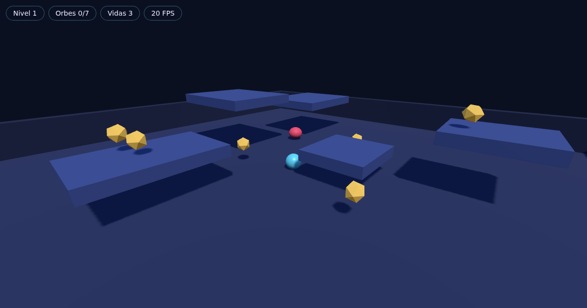

# Orbe Runner 3D

**Jugar online: https://orbe.naindev.com**

Un runner 3D arcade hecho desde cero. Eres **Lúmen**, la última chispa de luz de un
universo que el Vacío ya se ha comido. Cruzas un **Ciclo** tras otro recuperando
**Fragmentos de Estrella**, esquivando **Sombras** y sobreviviendo con tres capas de
Núcleo.

Cada Ciclo se compone solo, pero no al azar: se ensambla a partir de piezas escritas a
mano, y hay una garantía matemática de que **todo salto de la ruta es posible**.

- **Sin motor de juego.** Física, IA, cámara, generación de niveles, HUD y audio son
  código propio. La única dependencia es Three.js para dibujar.
- **Sin assets.** Modelos, texturas, música y efectos se generan en tiempo de ejecución.
  Cero bytes de imágenes o MP3.
- **Sin backend.** Archivos estáticos servidos desde un CDN. Un clic y estás jugando.
- **Open source, 0 € de coste.** MIT, herramientas libres de principio a fin.



---

## Jugar

| Tecla | Acción |
| :--- | :--- |
| `W A S D` / flechas | Moverse, relativo a la cámara |
| `Espacio` | Saltar — mantén pulsado para saltar más alto |
| `Shift` | **Impulso**: atraviesas el espacio, nada puede tocarte, y las Sombras frágiles se fracturan |
| Ratón | Cámara |
| `Esc` | Pausa |

En móvil: joystick analógico a la izquierda, cámara a la derecha, y botones de salto e
Impulso. Un toque rápido en la zona derecha también salta.

### Las dos reglas que hay que aprender

- **Las Sombras y el plasma se cobran el Núcleo.** Eso es lo que esquivas.
- **El Vacío se cobra la Resonancia.** Caerte te devuelve a la última Baliza y te borra
  la racha, pero no te cuesta una vida.

El resto está en el **Registro**, dentro del propio juego.

---

## Desarrollo

Requiere Node 18 o superior.

```bash
git clone https://github.com/Nain9Dev/orbe-runner-3d.git
cd orbe-runner-3d
npm install
npm run dev
```

| Comando | Qué hace |
| :--- | :--- |
| `npm run dev` | Servidor de desarrollo con recarga en caliente |
| `npm test` | Suite completa (Vitest) |
| `npm run build` | Compila a `dist/` |
| `npm run preview` | Sirve el build de producción |

**Stack**: TypeScript · Vite · Three.js · Web Audio API · DOM plano para la interfaz.
Está fijado en [`AGENTS.md`](AGENTS.md) y no se cambia sin un ADR aprobado.

---

## Cómo está montado

Un **ECS** (Entity–Component–System) de unas 200 líneas, y cuatro capas con una regla de
dependencia estricta.

```
src/
├── main.ts               # monta el mundo y enchufa los sistemas: esto ES el juego
├── config.ts             # todos los números ajustables del "feel"
│
├── core/                 # motor genérico: no sabe qué es un orbe
│   ├── world.ts          #   ECS: entidades, consultas, registro de sistemas
│   ├── engine.ts         #   bucle de paso fijo (lógica) + dibujado por frame
│   ├── events.ts         #   bus de eventos
│   └── input.ts          #   teclado, ratón y táctil como estado consultable
│
├── domain/               # matemática pura, sin importar NADA
│   ├── jump-arc.ts       #   hasta dónde llega un salto → alcanzabilidad de niveles
│   └── integrity.ts      #   invariantes de la vida del jugador
│
├── game/                 # contenido
│   ├── chunks.ts         #   biblioteca de piezas de nivel escritas a mano
│   ├── composer.ts       #   Ciclo → plano verificable (datos puros)
│   ├── level.ts          #   plano → entidades
│   ├── prefabs.ts        #   catálogo de objetos
│   └── models.ts         #   modelos procedurales
│
├── systems/              # lógica
│   ├── player.ts         #   intención → velocidad
│   ├── physics.ts        #   velocidad → posición + colisiones
│   ├── enemy.ts          #   máquinas de estado de cada arquetipo
│   ├── projectile.ts     #   proyectiles
│   ├── triggers.ts       #   contactos → eventos de juego
│   ├── game.ts           #   las reglas: Fragmentos, Núcleo, Ciclos
│   ├── camera.ts, render.ts, audio.ts, particles.ts, avatar.ts, powerups.ts
│   └── hud.ts            #   enlace mundo → interfaz, y nada más
│
└── ui/                   # presentación: sólo DOM, cero conocimiento del juego
    ├── health.ts         #   Integridad del Núcleo
    ├── widgets.ts        #   Impulso, Resonancia, progreso, avisos
    ├── screen.ts         #   viñetas a pantalla completa
    └── menu.ts           #   menús, ajustes, Registro
```

Cada frame:

```
entrada → sistemas de lógica (paso fijo 1/60) → eventos → dibujado
```

El paso fijo hace que la física se comporte igual a 30 que a 144 FPS.

### Dos ideas que merece la pena entender

**Los niveles se verifican antes de existir.** `composer.ts` convierte un número de Ciclo
en un *plano*: objetos planos, sin Three.js y sin ECS. Eso permite comprobar treinta
Ciclos de diseño de nivel en milisegundos — que todo salto sea alcanzable, que no haya
tres piezas tensas seguidas, que haya checkpoint — antes de instanciar una sola entidad.

**El alcance del salto se deriva, no se escribe.** `domain/jump-arc.ts` calcula la
distancia máxima de salto a partir de la gravedad, el impulso y la velocidad. El
compositor la usa para dimensionar cada hueco. Si mañana cambias la gravedad, todos los
niveles del juego se reajustan solos.

---

## Cómo se amplía

**Un objeto nuevo** (`src/game/prefabs.ts`):

```ts
definePrefab('trampolin', ({ position }) => ({
  tag: 'trampolin',
  transform: { position: position.clone(), yaw: 0 },
  solid: { size: new THREE.Vector3(3, 0.5, 3) },
  bounce: { force: 18 },
  render: { mesh: mesh(GEO.box, MAT.platform, new THREE.Vector3(3, 0.5, 3)) },
}));
```

**Una pieza de nivel nueva** (`src/game/chunks.ts`): una entrada más en el array, con su
intensidad y su Ciclo mínimo. El compositor la usará sola, y los tests comprobarán su
alcanzabilidad sin que escribas nada.

**Una mecánica nueva**: un sistema que filtre por su componente, y una línea en
`src/main.ts`. Ni el motor, ni el render, ni la física se enteran.

**Ajustar el "feel"**: todo está en `src/config.ts`, y el *porqué* de cada número está en
[`docs/22-game-design.md`](docs/22-game-design.md).

**Probar en caliente**: en la consola del navegador tienes `GAME`.

```js
GAME.CONFIG.player.jump = 20;
GAME.world.removeSystem('enemy');    // modo paseo
GAME.world.state.status;             // 'playing' | 'paused' | 'gameover' | ...
```

---

## Documentación

El proyecto sigue un flujo dirigido por especificación. La constitución está en
[`AGENTS.md`](AGENTS.md); el mapa completo, en [`docs/README.md`](docs/README.md).

| Si quieres saber | Lee |
| :--- | :--- |
| Cómo se llama cada cosa y por qué | [`docs/20-lore.md`](docs/20-lore.md) |
| Por qué un número es ese número | [`docs/22-game-design.md`](docs/22-game-design.md) |
| Qué puede leer la interfaz y cómo lo pinta | [`docs/23-interface.md`](docs/23-interface.md) |
| En qué capa va un cambio | [`docs/20-architecture.md`](docs/20-architecture.md) |
| Por qué el código tiene esta forma | [`docs/30-decisions/`](docs/30-decisions/) |
| Si un requisito está realmente demostrado | [`docs/50-traceability.md`](docs/50-traceability.md) |

---

## Publicarlo en internet

Es HTML estático, así que cualquier hosting gratuito aguanta de sobra. El repo está
preparado para **GitHub Pages**: `CNAME` apunta a `orbe.naindev.com`, `.nojekyll` evita
que Pages lo procese con Jekyll, y el workflow de `.github/workflows/` republica en cada
push a `main`.

Una sola vez:

1. **Settings → Pages → Source: GitHub Actions**.
2. En el DNS de `naindev.com`:

   | Tipo | Nombre | Valor |
   | :--- | :--- | :--- |
   | CNAME | `orbe` | `nain9dev.github.io` |

3. Cuando GitHub emita el certificado, marca **Enforce HTTPS**. Hace falta HTTPS para que
   funcione el bloqueo del puntero.

Sin dominio propio queda en `https://nain9dev.github.io/orbe-runner-3d/` (borra `CNAME`).

---

## Licencia

MIT — ver [`LICENSE`](LICENSE). Usa [Three.js](https://threejs.org) (MIT) como única
dependencia de ejecución.
