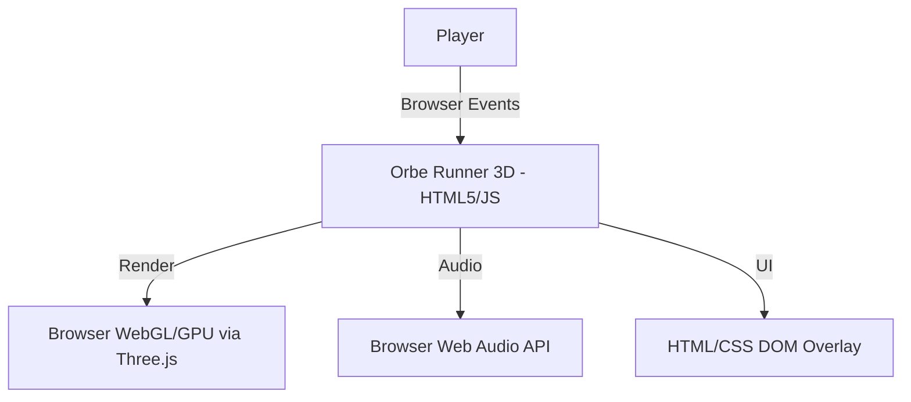
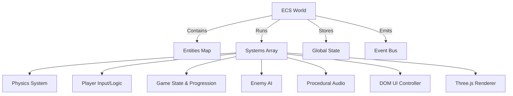
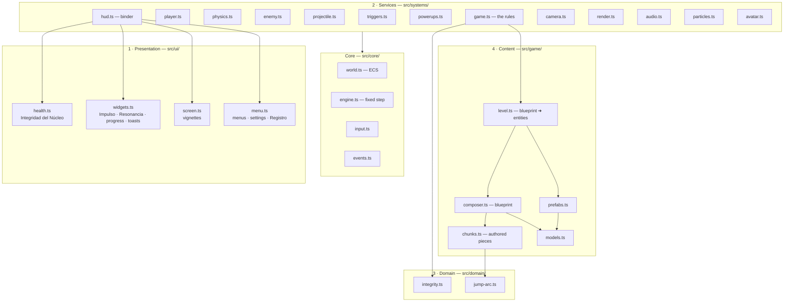
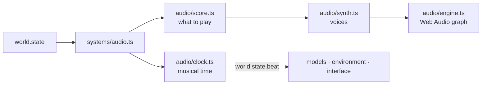

# Architecture

## System Context

Orbe Runner 3D is a purely client-side application. It does not communicate with any backend services for gameplay logic, ensuring zero latency and deterministic execution based entirely on local browser hardware.

## ECS (Entity-Component-System) Architecture

The game utilizes a custom, lightweight ECS architecture to decouple logic from data and rendering. This paradigm shift enables highly dynamic gameplay loops and procedural complexity.

1. **Entities (`src/game/prefabs.ts`)**: Pure data structures identified by an integer ID. They contain components like `transform`, `body` (physics), `solid`, `render`, `player`, `enemy`, etc.
2. **Systems (`src/systems/`)**: Logic modules that query the ECS world for entities with specific components. They have three lifecycle hooks:
   - `init(world)`: Setup logic (DOM elements, Event listeners).
   - `update(world, dt)`: Runs every frame, mutating entity components based on rules.
   - `render(world, alpha)`: Renders the current state to the screen/speakers.
3. **World (`src/core/world.ts`)**: The orchestrator that manages entities, runs the system pipeline, and holds the game's global state (`timeScale`, `level`, `score`, `combo`).

## Design Decisions

1. **Client-Side Rendering Only**: To maintain the "1-click, zero-latency" requirement, we explicitly avoid server-side authoritative logic or languages like Python. The game runs directly from static files hosted on GitHub Pages.
2. **Three.js over Heavy Engines**: We use Three.js instead of Unity/Godot WebGL exports to guarantee minimal bundle size and instantaneous loading times.
3. **TypeScript & Vite**: The codebase uses TypeScript for structural safety and Vite for ultra-fast HMR and production minification.
4. **Procedural Audio**: We avoid external MP3/OGG assets to keep the bundle size minimal. All music and SFX are generated at runtime using the `AudioContext` oscillator API.

---

## Layers (spec 024)

`AGENTS.md` fixes the layer order; spec 024 is where the codebase finally matches it. The
strictest rule first: **the presentation layer never imports the domain, the content or
the ECS.**

There is no repository layer: the game holds no persistent data beyond five
`localStorage` keys, and those are read and written in `src/ui/menu.ts`, which is the only
module that knows they exist.

### Why `src/domain/` exists at all

Two pieces of arithmetic decide whether the game is fair, and both are worth being able to
test without a renderer, a canvas or a frame loop:

- **`jump-arc.ts`** — how far Lúmen can jump, derived from gravity, jump impulse and
  speed. The level composer trusts it, so a hard-coded "max gap = 10" would silently break
  the moment anyone re-tuned gravity.
- **`integrity.ts`** — three lines of subtraction that decide whether a run ends.

Both import nothing.

### Why the composer is separate from the level builder

`composer.ts` turns a Ciclo number into a **blueprint**: plain objects, no Three.js, no
ECS, no side effects. `level.ts` turns a blueprint into entities. That split is what lets
`tests/level.test.ts` verify thirty Ciclos of level design in milliseconds — reachability,
rhythm, checkpoint placement, Fragmento tiers — and it is why the reachability guarantee
can be enforced *before* a single entity exists.

## System execution order

Order is meaningful; this is the pipeline, in `src/main.ts`:

| # | System | Reads | Writes |
| :--- | :--- | :--- | :--- |
| 1 | `render` | — | `state.three` (init only) |
| 2 | `player` | input, `state.cameraYaw` | `body.velocity`, `state.dash*` |
| 3 | `enemy` | player position | Sombra velocities, telegraph events |
| 4 | `interceptor` | player position | Interceptor velocity |
| 5 | `drone` | player, Sombras | Dron velocity, `enemy:hit` |
| 6 | `projectile` | solids | bolt positions |
| 7 | `physics` | velocities | positions, contacts |
| 8 | `triggers` | positions | `orb:collected`, `player:hit`, `enemy:hit` |
| 9 | `shockwave` | `enemy:shockwave` | player velocity, `player:hit` |
| 10 | `camera` | player, `state.dashing` | camera transform, `state.cameraYaw` |
| 11 | `avatar` | bodies | model animation |
| 12 | `particles` | events | particle pool |
| 13 | `game` | events | `state.*`, Ciclo transitions |
| 14 | `powerups` | `player.buff` | `state.timeScale`, Fragmento attraction |
| 15 | `hud` | `state.*` | DOM |
| 16 | `audio` | events, `state.combo` | Web Audio |

`render` is registered first so its `init` creates the scene before anything wants to add
a mesh to it; its **draw** happens in the `render` phase, which the world runs after every
`update`.

## Frame budget notes

- The integrator sub-steps at most four times per frame, chosen from the fastest body's
  displacement. At the dash speed that is two.
- The contact solver is O(n²) over bodies. A Ciclo caps at 30 Sombras plus Lúmen plus the
  Dron, so the worst case is ~500 pair tests per solver iteration.
- Projectiles are deliberately **not** bodies: they carry no mass and would otherwise add
  a dozen entries to that quadratic loop for behaviour nobody wants.
- No `import()` inside any loop. Three used to exist — in the HUD, the renderer and the
  audio system — each creating a promise per frame to read a boolean from an
  already-loaded module.

## The aural layer (spec 025)

`src/audio/` is the exact counterpart of `src/ui/`: a presentation layer that owns its own
medium and knows nothing about the ECS. `src/systems/audio.ts` is its binder.

Same rules as `src/ui/`: no ECS, no Three.js, and the only permitted import is
`src/config.ts`. The contract is documented in [24-audio.md](24-audio.md), and the reason
there is a shared clock at all is [ADR-011](30-decisions/011-shared-musical-clock.md).

**The clock is the interesting part.** It is what makes the models, the bloom and the
music share a phase by construction rather than by coincidence — and it runs on an
injected time source, so a browser with no audio still has a pulsing world and the whole
module is testable without Web Audio.
