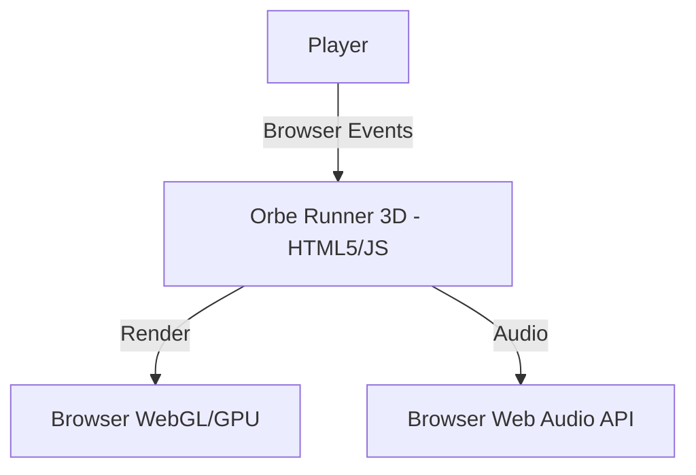

# Architecture

## System Context

Orbe Runner 3D is a purely client-side application. It does not communicate with any backend services for gameplay logic, ensuring zero latency and deterministic execution based entirely on local browser hardware.

## Component Architecture

The game utilizes a modular structure despite being built in Vanilla JS.

1. **Core Loop (`main.js`)**: Orchestrates the `requestAnimationFrame` loop, managing delta time and state transitions.
2. **Rendering (`Three.js`)**: All 3D rendering is handled by the `three.module.js` library.
3. **Systems (`src/systems/`)**: Handles specific domains such as collision detection, input handling, and particle effects.
4. **Game Logic (`src/game/`)**: Contains entity definitions (the Orbe, obstacles, track generation).

## Design Decisions

1. **Client-Side Rendering Only**: To maintain the "1-click, zero-latency" requirement, we explicitly avoid server-side authoritative logic or languages like Python. The game runs directly from static files hosted on GitHub Pages.
2. **Three.js over Heavy Engines**: We use Three.js instead of Unity/Godot WebGL exports to guarantee minimal bundle size and instantaneous loading times.
3. **Module Pattern**: The current codebase uses ES6 modules for organization. Future iterations will adopt TypeScript and Vite for stricter typings and automated bundling, respectively.
