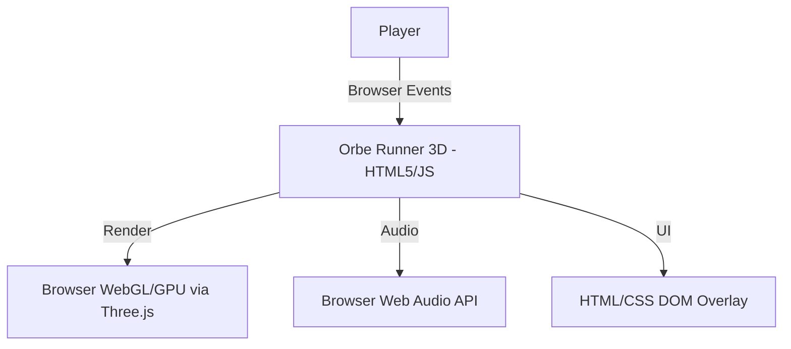
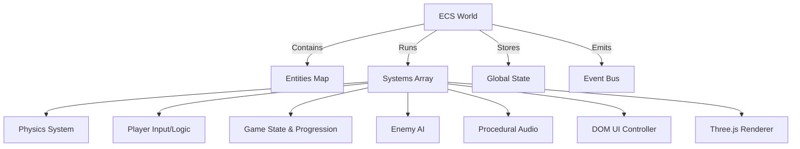

# Architecture

## System Context

Orbe Runner 3D is a purely client-side application. It does not communicate with any backend services for gameplay logic, ensuring zero latency and deterministic execution based entirely on local browser hardware.

## ECS (Entity-Component-System) Architecture

The game utilizes a custom, lightweight ECS architecture to decouple logic from data and rendering. This paradigm shift enables highly dynamic gameplay loops and procedural complexity.

1. **Entities (`src/game/prefabs.ts`)**: Pure data structures identified by an integer ID. They contain components like `transform`, `body` (physics), `solid`, `render`, `player`, `enemy`, etc.
2. **Systems (`src/systems/`)**: Logic modules that query the ECS world for entities with specific components. They have three lifecycle hooks:
   - `init(world)`: Setup logic (DOM elements, Event listeners).
   - `update(world, dt)`: Runs every frame, mutating entity components based on rules.
   - `render(world, alpha)`: Renders the current state to the screen/speakers.
3. **World (`src/core/world.ts`)**: The orchestrator that manages entities, runs the system pipeline, and holds the game's global state (`timeScale`, `level`, `score`, `combo`).

## Design Decisions

1. **Client-Side Rendering Only**: To maintain the "1-click, zero-latency" requirement, we explicitly avoid server-side authoritative logic or languages like Python. The game runs directly from static files hosted on GitHub Pages.
2. **Three.js over Heavy Engines**: We use Three.js instead of Unity/Godot WebGL exports to guarantee minimal bundle size and instantaneous loading times.
3. **TypeScript & Vite**: The codebase uses TypeScript for structural safety and Vite for ultra-fast HMR and production minification.
4. **Procedural Audio**: We avoid external MP3/OGG assets to keep the bundle size minimal. All music and SFX are generated at runtime using the `AudioContext` oscillator API.
