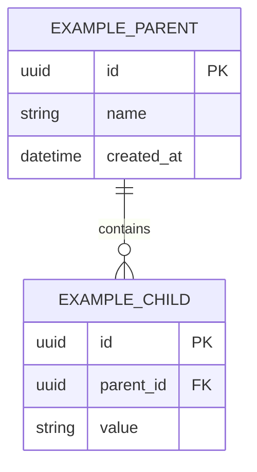

# Data model

Status: Draft

## Entity-relationship diagram

Kept in sync with the actual schema; update it in the same commit as any migration.

## Entities and invariants

### [Entity name]

- [Invariant that must always hold.]

## Persistence

- [Engine, migration tool, naming conventions.]
