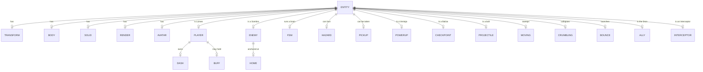

# Data model

Status: Draft

There is no database. The "schema" of this game is the set of components an entity may
carry and the keys `world.state` may hold. Both are listed here in full, and both are
part of the contract: a system may only read what this document says exists.

---

## 1. Entity–component relationships

> **Query by component, never by tag.** `entity.tag` is a human label. `world.find('drone')`
> looks for a *component* named `drone`; the Dron prefab only ever had `tag: 'drone'`, so
> that query matched nothing and the Dron never moved. The same mistake made the Imán
> Ventaja inert for its entire existence (`world.query('orb')` — Fragmentos carry
> `pickup`, not `orb`). Both are fixed; the rule is in force.

---

## 2. Components

### 2.1 Universal

| Component | Fields | Notes |
| :--- | :--- | :--- |
| `transform` | `position: Vector3`, `yaw: number` | Logical position. The renderer copies it to the mesh. |
| `render` | `mesh: THREE.Object3D` | Added to the scene on spawn, removed on destroy. |
| `avatar` | `api: { group, update(dt, state), react?(kind) }` | A model with a life of its own. |

### 2.2 Physics

| Component | Fields | Owner |
| :--- | :--- | :--- |
| `body` | `velocity: Vector3`, `radius`, `mass`, `grounded`, `contact`, `groundTimer`, `groundNormal: Vector3`, `carry: Vector3`, `friction`, `drag`, `bounciness`, `wallBounce`, `noGravity`, `damped` | `physics` |
| `solid` | `size: Vector3` | Static AABB |
| `moving` | `axis: 'x'\|'z'`, `range`, `speed`, `origin`, `t`, `dx`, `dz` | `physics` |
| `crumbling` | `state: 'idle'\|'crumbling'\|'gone'`, `timer`, `duration`, `respawn` | `physics` |
| `bounce` | `force`, `pulse` | `physics` |

Three fields deserve their own note because each one exists to fix a specific defect:

- **`carry`** — displacement owed by a moving platform, accumulated during the solver and
  applied exactly once. It used to be applied inside the contact handler, i.e. three times
  per frame, so platforms flung the player.
- **`contact` vs `grounded`** — `contact` is the raw solver answer this sub-step;
  `grounded` is the answer gameplay sees, held for `groundStickTime` so a seam between two
  platforms does not read as a fall.
- **`crumbling.state`** — a tile in state `gone` is skipped by the solver and by
  projectile collision, then reforms. It is never destroyed: a destroyed tile permanently
  removed a route the player still needed, which made a whole Ciclo unwinnable after one
  fall. See `docs/22-game-design.md` §3.5.
- **`damped`** — a controller has already resolved this body's horizontal velocity for the
  frame, so the integrator must not damp it again. Without it the player's steady-state
  speed settled 20 % below `CONFIG.player.speed`, and every gap the composer sized
  inherited the error.

### 2.3 Lúmen

| Component | Fields |
| :--- | :--- |
| `player` | `lives`, `maxLives`, `invulnerable`, `spawn: Vector3`, `checkpoint: Vector3`, `coyote` (seconds), `jumpBuffer` (seconds), `rising: boolean`, `dash`, `buff` |
| `player.dash` | `time`, `cooldown`, `airLeft`, `dir: Vector3`, `held: boolean` |
| `player.buff` | `type: 'shield'\|'magnet'\|'jump'\|'time'`, `timeleft` (real seconds) |

`coyote` is in **seconds**. It used to be a frame counter, which made the grace window
twice as generous at 30 FPS as at 60.

### 2.4 Sombras

| Component | Fields |
| :--- | :--- |
| `enemy` | `type`, `speed`, `aggroRange`, `home: Vector3`, `hover`, `leash`, `fragile`, `integrity`, `stun` |
| `fsm` | `state`, `timer`, `phase`, `aim: Vector3` |
| `hazard` | `radius`, `damage`, `box?: Vector3`, `push?` |
| `interceptor` | `speed`, `hover` |
| `ally` | `followDist`, `fireTimer`, `hover` |
| `projectile` | `ttl`, `damage`, `speed`, `dir: Vector3` |

`hazard.box` makes a hazard rectangular. Plasma pools are rectangles; testing them with a
radius either kills the player standing beside one or lets them stand in a corner of one.

### 2.5 Collectibles and Balizas

| Component | Fields |
| :--- | :--- |
| `pickup` | `value`, `spin`, `base` (bob height), `tier: 'path'\|'risk'` |
| `powerup` | `type` |
| `checkpoint` | `reached: boolean`, `radius` |

---

## 3. World state

`world.state` is the single channel between the simulation and the interface. The
presentation layer reads only from here.

### 3.1 Run

| Key | Type | Meaning |
| :--- | :--- | :--- |
| `status` | `'menu'\|'playing'\|'paused'\|'levelup'\|'gameover'` | The state machine of the run |
| `level` | number | Current Ciclo |
| `collected` / `totalOrbs` | number | Fragmentos taken and in the Ciclo |
| `score` | number | **Luz** — the sum of Fragmento values plus 5 per shattered Sombra |
| `sequence` | string[] | Chunk ids of the current Ciclo |
| `beacons` | number | Balizas spawned |
| `timeScale` | number | 1, 0.4 under Cámara Lenta, 0.05 during the death pause |
| `gameOverIn` | number | Simulated seconds until the game-over menu |

### 3.2 Lúmen

| Key | Type | Meaning |
| :--- | :--- | :--- |
| `integrity` / `maxIntegrity` | number | Capas de Núcleo |
| `critical` | boolean | One layer or fewer |
| `shield` | boolean | Escudo active |
| `buff` | `{ type, timeleft }` \| null | Active Ventaja |
| `combo` | number | Resonancia |
| `comboTimer` / `comboWindow` | number / 0..1 | Seconds left, and the same as a ratio for the HUD arc |
| `dashRatio` | 0..1 | Impulso readiness |
| `dashing` | boolean | An Impulso is in flight |
| `invulnerable` | boolean | i-frames active |
| `playerSpeed` | number | Current horizontal speed |
| `cameraYaw` | number | Published by the camera, consumed by the controller |

### 3.3 Seams

| Key | Type | Why it exists |
| :--- | :--- | :--- |
| `three` | `{ scene, camera, renderer }` | The renderer's handles |
| `spawn` | `(world, name, opts) => entity` | Lets `enemy.ts` create bolts without importing the prefab registry, which is what keeps it testable in isolation |
| `burst` | `(origin, hex, count, opts)` | Direct access to the particle pool |

### 3.4 Deprecated

| Key | Replacement | Removal target |
| :--- | :--- | :--- |
| `state.lives` | `state.integrity` | Spec 026 |

`lives` is kept as a mirror so console mods and older notes keep working. It is written
everywhere `integrity` is written and read nowhere in the engine.

---

## 4. Persistence

`localStorage` only, all writes wrapped in `try/catch` because private modes and some
embeds throw on access.

| Key | Type | Meaning |
| :--- | :--- | :--- |
| `orbi_level` | string | Starting Ciclo, 1–30 |
| `orbi_color` | string | Frecuencia, e.g. `0x6ee7ff` |
| `orbi_mute` | `'true'\|'false'` | Sound off |
| `orbi_gfx` | `'true'\|'false'` | `true` = low quality |
| `orbi_shake` | `'true'\|'false'` | Camera shake |

---

## 5. Event vocabulary

The bus is the only coupling between systems. Anything may raise these, so every listener
must tolerate a payload that is missing optional fields.

| Event | Payload | Raised by |
| :--- | :--- | :--- |
| `entity:spawned` / `entity:destroyed` | entity | `world` |
| `level:built` | `{ level, spec, blueprint }` | `level` |
| `game:start` | `{ level, lives }` | UI, `game` |
| `game:levelup` / `game:over` | `{ level, score }` | `game` |
| `orb:collected` | `{ orb, value, tier }` | `triggers` |
| `powerup:collected` / `powerup:expired` | `{ powerup }` / buff | `triggers`, `powerups` |
| `player:jump` / `player:landed` / `player:dash` | entity | `player` |
| `player:damaged` | `{ player, at, shielded, lost, critical }` | `game` |
| `player:voided` | `{ player, lostStreak }` | `game` |
| `player:anchored` | `{ player, beacon, at }` | `triggers` |
| `player:hit` | `{ player, source }` | `triggers`, `shockwave` |
| `body:fell` | entity | `physics` |
| `enemy:telegraph` | `{ enemy, kind, duration, at }` | `enemy` |
| `enemy:hit` | `{ enemy, amount, from }` | `triggers`, `drone` |
| `enemy:shattered` / `enemy:stunned` | `{ enemy, at }` | `enemy` |
| `enemy:shockwave` | `{ enemy, at, radius, damage }` | `enemy` |
| `enemy:fired` / `enemy:phase` | `{ enemy, at }` / `{ enemy, phase }` | `enemy` |
| `projectile:impact` / `projectile:expired` | `{ at }` | `projectile` |
| `platform:collapsed` | entity | `physics` |
| `combo:lost` | — | `game` |
| `ui:message` / `ui:pause` / `ui:hide` / `ui:toast` | see [23-interface.md](23-interface.md) | `game`, UI |
| `particles:burst` / `particles:shockwave` | `{ pos \| at, color, count, radius }` | any |
