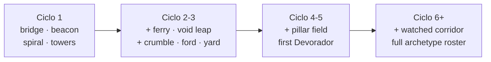

# Game design — feel, level rhythm, enemy contract

Status: **Draft** · Covers REQ-024.44

This is the document to open before changing a number. It records not just the values the
game is tuned to but *why each one is that value*, so a future change can be checked
against an intention instead of against taste. Every constant referenced here lives in
[`src/config.ts`](../src/config.ts); if you change one there, change the table here in the
same commit.

---

## 1. The design pillars

1. **The avatar does what the hand asked, on the frame it asked.** Every deviation from
   this is a bug, including the ones that make the game easier.
2. **Difficulty is legible.** A player who loses a layer of Núcleo can always point at
   the moment they should have moved. This is why the telegraph floor exists.
3. **The level is authored, the sequence is generated.** Infinite progression is a
   pillar of the charter; noise is not.
4. **One verb, three uses.** The Impulso crosses, dodges and kills. The game is the
   tension between those.
5. **Mistakes have proportionate prices.** A missed jump is not worth a third of a run.

---

## 2. The movement arc

Everything about how the game feels comes out of five numbers and their consequences.

| Quantity | Source | Value |
| :--- | :--- | :--- |
| Gravity | `world.gravity` | 20 u/s² |
| Fall multiplier | `world.fallGravityMultiplier` | ×1.55 |
| Apex multiplier | `world.apexGravityMultiplier` | ×0.72 below \|v<sub>y</sub>\| = 3.2 |
| Jump impulse | `player.jump` | 12.5 u/s |
| Movement speed | `player.speed` | 14 u/s |

### 2.1 Derived, and measured

The analytic model lives in [`src/domain/jump-arc.ts`](../src/domain/jump-arc.ts). The
measured column comes from driving the shipped game and recording the arc.

| Quantity | Model | Measured in-engine | Note |
| :--- | :--- | :--- | :--- |
| Apex height | 3.91 u | 3.70 u | Measured one frame after take-off, so v<sub>y</sub> is 12.17 rather than 12.5 |
| Rise time | 0.625 s | 0.683 s | The apex multiplier buys hang time |
| Total air time | 1.127 s | 1.283 s | |
| Flat jump distance | 15.78 u | **17.75 u** | |
| Cruise speed | 14 u/s | 13.98 u/s | |
| Impulso distance | 6.80 u | 6.73 u | `dash.speed × dash.time` |
| Impulso cadence | 1.05 s | — | `dash.time + dash.cooldown` |

**The model under-reports by about 12 %, and that is deliberate.** It ignores apex hang
time and air acceleration, so anything built on it is conservative. The level composer
trusts it, which means the composer is never optimistic about what the player can reach.

### 2.2 Asymmetric gravity

A jump that rises and falls at the same rate reads as floaty. Three different gravities
fix that without changing the apex the player aims at:

```
        apex ─── ×0.72 ──   hang time, where you actually aim
            ╱          ╲
   ×1.00  ╱              ╲  ×1.55   snappy landing
        ╱                  ╲
   ────╯                    ╰────
```

### 2.3 The forgiveness budget

Three mechanisms exist purely so that a correct intention is not punished by a few
milliseconds of imprecision. They are cheap, invisible when they work, and immediately
felt when absent.

| Mechanism | Value | What it forgives |
| :--- | :--- | :--- |
| Jump buffer | 0.14 s | Pressing jump slightly before landing |
| Coyote time | 0.11 s | Pressing jump slightly after leaving the ledge |
| Ground stick | 0.08 s | A one-frame gap between two surfaces reading as a fall |

Coyote time is measured in **seconds**, not frames. The previous implementation counted
frames, which made the grace window twice as generous at 30 FPS as at 60 — the game was
literally easier on a slower machine.

### 2.4 Variable jump height

Releasing the jump key during the rise cuts upward velocity to 42 %
(`player.jumpCutFactor`). One button therefore covers a 0.7 u hop and a 3.9 u leap, which
removes the need for a second button and makes short platforms usable.

**Consequence worth knowing:** an input scheme that releases jump on the take-off frame
produces only hops. A scripted agent that does this appears to be unable to cross the
level; the level is fine.

---

## 3. Level rhythm

### 3.1 Chunks, not noise

A Ciclo is assembled from the authored library in
[`src/game/chunks.ts`](../src/game/chunks.ts). Each chunk is one legible idea with a
declared intensity.

| Intensity | Meaning | Chunks |
| :--- | :--- | :--- |
| 0 — rest | Safe, wide, often a Baliza | `anchor_bridge`, `rest_beacon` |
| 1 — steady | A mechanic to execute, low failure cost | `spiral_ascent`, `bounce_towers`, `moving_ferry`, `shatter_yard` |
| 2 — tension | Real failure cost | `void_leap`, `crumble_gauntlet`, `plasma_ford`, `pillar_field`, `watched_corridor` |

### 3.2 The curve



Two rules shape every sequence, and both are asserted over thirty seeds in
`tests/level.test.ts`:

- **Rhythm.** No more than `level.maxTensionRun` = 2 tension chunks in a row; a rest is
  forced afterwards. Tension only reads as tension against a rest.
- **Appetite.** The probability of drawing a tension chunk rises from 0.25 at Ciclo 1
  towards a ceiling of 0.7. Length grows from 5 chunks to a cap of 10.

### 3.3 Reachability

Every jump on the critical path satisfies

```
horizontal_distance ≤ maxJumpDistance(Δh) × level.reachSafety
```

with `reachSafety` = 0.70. Against the model's 15.78 u that budgets 11.0 u; against the
measured 17.75 u it spends about 62 % of the real reach. Demanding enough to need a
run-up, forgiving enough to survive a late input.

Two details that took a rewrite to get right, recorded so nobody re-derives them:

- **Correcting a route cascades.** Shortening one hop pulls its landing node backwards,
  which lengthens the next hop. Correction therefore happens **per chunk**, sliding the
  whole rigid piece along its junction, not per node after the fact.
- **Walking is not jumping.** A 16 u plaza is crossed on foot. Path nodes on a continuous
  surface are flagged `walk` and excluded from the guard, or every wide platform in the
  library looks like an impossible gap.

### 3.4 Fragmento placement

| Tier | Share | Placement | Worth |
| :--- | :--- | :--- | :--- |
| `path` | majority (asserted) | Above critical-path nodes | 1 |
| `risk` | ≥ 1 from Ciclo 2 (guaranteed) | Over gaps, past plasma, on pad-only ledges | 3 |

When a Ciclo happens to draw only chunks that carry no risk Fragmento, the composer hangs
one over the longest jump on the route. A Ciclo with no reason to leave the critical path
is a Ciclo with no decisions in it.

### 3.5 Collapsing tiles must come back

A tile of the Sendero Efímero collapses 1.5 s after the first footfall and **reforms 2.5 s
later**. The reform is not a nicety, it is a correctness requirement.

The first implementation destroyed the tile permanently. The Baliza that covers the
gauntlet sits *before* it, so the sequence was: cross the gauntlet, miss the next jump,
respawn at the Baliza — and find that the route no longer exists. The Ciclo became
impossible to finish, and the only way out was to die on purpose. A scripted route
follower reproduced it as 55 consecutive falls on Ciclo 3; with the fix, the same agent
completes that Ciclo with two.

The general rule this is an instance of: **no failure may permanently remove a route the
player still needs.** Anything else in the library that consumes itself has to reform too.

---

## 4. Enemy contract

### 4.1 The telegraph floor

`enemy.telegraphFloor` = **0.45 s**. No hostile action in the game begins with less
warning, and `enter()` in [`src/systems/enemy.ts`](../src/systems/enemy.ts) clamps every
telegraph to it. This single constant is the difference between hard and unfair.

| Archetype | Telegraph | Duration | Commit |
| :--- | :--- | :--- | :--- |
| Rastreador | `lunge_wind` — stops, faces you | 0.50 s | 0.34 s lunge at 3.1× speed |
| Acechante | `wind` — stops orbiting, faces you | 0.50 s | 0.40 s strike at 3.4× speed |
| Coloso | `leap_wind` — crouches | 0.75 s | Leap, then a 6.5 u shockwave for 2 layers |
| Centinela | `aim` — locks on | 0.60 s | One bolt at 17 u/s |
| Interceptor | `aiming` — hangs and turns | 0.55 s | 0.55 s crossing at 21 u/s |
| Devorador | `slam_wind` / `volley_wind` | 0.80 / 0.60 s | Slam (9 u, 3 layers) or a 7–10 bolt ring |

The heaviest hit in the game has the longest wind-up. That is not a coincidence; it is
the rule.

### 4.2 Fragility

| Archetype | Integrity | Impulsos to break |
| :--- | :--- | :--- |
| Rastreador, Acechante, Interceptor | 1 | 1 |
| Centinela | 2 | 2 |
| Coloso | 3 | 3 |
| Devorador | 9 | 9 |

An Impulso that fails to break a Sombra still stuns it for `enemy.stunTime` = 1.1 s, so
charging a Coloso is a real option rather than a mistake.

### 4.3 Damage

| Source | Layers |
| :--- | :--- |
| Rastreador, Acechante, Centinela bolt, Interceptor | 1 |
| Coloso body, Coloso shockwave | 2 |
| Devorador body, Devorador slam | 3 |
| Plasma | 10 — always lethal, always absorbed whole by an Escudo |
| **El Vacío** | **0** — see §5 |

### 4.4 Leash and hover

Grounded Sombras chasing Lúmen across a Salto del Vacío simply fall, and the Ciclo
quietly empties itself after two long jumps. Two mechanisms prevent it:

- **Leash** (34 u): a Sombra too far from its slot steers home.
- **Hover**: the Acechante, Centinela, Interceptor, Devorador and Dron ignore gravity and
  hold an altitude. Shadow entities that drift do not fall off the level.

---

## 5. The cost of failure

| Failure | Cost | Reasoning |
| :--- | :--- | :--- |
| Touched by a Sombra | 1–3 layers, 1.5 s of invulnerability | The thing you are meant to dodge |
| Plasma | The run, unless an Escudo is up | Visible, static, avoidable |
| **Falling into the Vacío** | **The Resonancia, plus the seconds to get back** | See below |
| Núcleo at zero | The run | |

Falling originally cost one layer, like any other hazard. A scripted agent then crossed
Ciclo 1 four times and ended every run at zero integrity with three falls and **zero**
enemy contacts. With three layers and gaps every seven units, that makes the void — not
the Sombras — the thing the game is about, and platforming mistakes are the ones a player
makes while they are still learning the arc.

The rule is now two lines, and it is teachable in one Ciclo:

- **Sombras and plasma take the Núcleo.** Those are what you dodge.
- **El Vacío takes the Resonancia.** That is what you lose by falling.

Full rationale and measurements:
[30-decisions/008-void-costs-resonance.md](30-decisions/008-void-costs-resonance.md).

---

## 6. Progression

| Ciclo | Chunks | Fragmentos | Sombras | Sombra speed | Roster added |
| :--- | :--- | :--- | :--- | :--- | :--- |
| 1 | 5 | ~12 | 3 | 4.9 | Rastreador |
| 3 | 5 | ~12 | 5 | 5.5 | Acechante |
| 5 | 7 | ~17 | 9 | 6.2 | Centinela, **Devorador** |
| 10 | 10 | ~26 | 17 | 7.1 | Interceptor, Coloso |
| 20 | 10 | ~26 | 30 (cap) | 8.6 | — |

Enemy count is capped at 30 and speed approaches 16.5 asymptotically, so a very long run
gets denser and faster without ever becoming a memory-allocation problem or a coin flip.

---

## 7. Measured difficulty

A scripted agent that follows the blueprint route, holds the jump key through the rise
and never dodges anything:

| Ciclo | Route completed | Falls | Hits taken | Ended by |
| :--- | :--- | :--- | :--- | :--- |
| 1 | yes | 0 | 0 | — (3/3) |
| 2 | yes | 0 | 0 | — (3/3) |
| 3 | yes | 2 | 0 | — (3/3) |
| 4 | yes | 0 | 1 | — (2/3) |
| 7 | node 30/32 | 1 | 4 | **Sombras** |
| 9 | node 9/30 | 5 | 3 | **Sombras** |
| 12 | node 15/33 | 1 | 3 | **Sombras** |
| 15 | node 24/35 | 0 | 4 | **Sombras** |
| 20 | node 25/31 | 2 | 3 | **Sombras** |

The intended shape, and it holds: the route is always walkable, falls are incidental, and
**every run past Ciclo 4 ends to enemies rather than to the void.** That is the whole
point of the split in §5 — if this table ever fills up with falls again, the tuning has
drifted.

Two invariants are checked alongside it, and both currently pass on every Ciclo tested:

- `orphanNodes: []` — every node on the critical path sits on top of a solid.
- `unreachable: []` — every jump fits the arc budget.

Re-run this whenever the arc, the reach budget or the archetype mix changes. It is the
cheapest signal in the project that the tuning still holds.

### 7.1 What a scripted agent cannot tell you

Recorded because two of the three "level defects" this harness reported were defects in
the harness:

- **Releasing jump on the take-off frame** triggers the variable-height cut and turns
  every jump into a 0.7 u hop. An agent that does this appears unable to cross any Ciclo.
- **Skipping `walk` nodes** makes the agent try to jump the full width of a plaza instead
  of walking across it.
- **Not re-acquiring the route after a respawn** makes it run off the same ledge forever.

The third report was real, and is the one below.

---

## 8. What would break this design

Recorded so a future change can be recognised as load-bearing before it lands:

- **Adding an attack button.** The Impulso's value is that it is the only verb and it is
  always in tension with itself. A second offensive option resolves the tension.
- **Making falls cost a layer again** without also cutting the gap count per Ciclo.
- **Removing the telegraph floor** to make higher Ciclos harder. Density is the difficulty
  lever; reaction time is not.
- **Making a chunk's internal geometry depend on the previous chunk.** Chunks are rigid
  bodies; that is what lets the composer slide them to fix a junction.
- **Letting `CONFIG.player.speed` drift from the real steady-state speed again.** Every
  gap in the game is sized from it.
