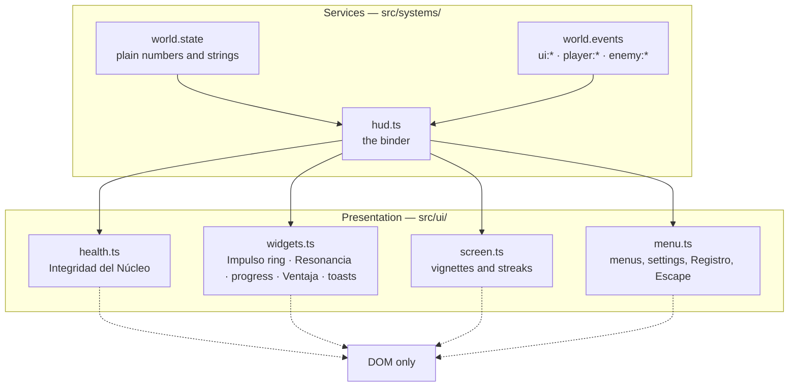

# Interface contract

Status: **Draft** · Covers REQ-024.29 … REQ-024.42

The interface is a **presentation layer with no knowledge of the game**. It receives
plain view-models and renders them. It never reads an entity, never touches the ECS, and
never decides a rule. This document is the contract between the two sides.

---

## 1. Layers



Rules, in force:

1. `src/ui/*` imports **nothing** from `src/core/`, `src/game/` or `src/systems/`. The one
   permitted import is `src/config.ts`, and only for user settings.
2. The binder never passes an entity. It passes numbers, strings and booleans.
3. Every widget **dirty-checks**. A value that has not changed produces no DOM write.
4. Nothing in `#hud` accepts pointer events. The HUD must never steal a click from the
   game.

### 1.1 The bug this structure exists to prevent

`hudSystem.render()` used to contain:

```js
el.score.textContent = world.state.collected.toString();
el.total.textContent = world.state.totalOrbs.toString();   // el.total === undefined
```

There is no `#hud-total` in the markup. The second line threw a `TypeError` **every
frame**, which aborted the rest of `render()` — the Ciclo counter, the FPS readout, the
Resonancia, the Ventaja timer and **the entire health bar** — and, because systems render
in registration order, also killed the render phase of every system registered after it.
The game looked like it worked only because the 3D renderer runs first.

`tests/hud.test.ts` now mounts the **real** `index.html` body and renders 120 frames. A
hand-written fixture would have reproduced the binder's own assumptions and passed
happily while the shipped page threw.

---

## 2. The view-model

Everything the interface reads, in one table. If it is not here, the interface does not
know about it.

| Key | Type | Consumer |
| :--- | :--- | :--- |
| `state.level` | number | Ciclo readout |
| `state.collected` / `state.totalOrbs` | number | Progress bar |
| `state.score` | number | Luz |
| `state.integrity` / `state.maxIntegrity` | number | Integrity meter |
| `state.critical` | boolean | Meter alarm, critical vignette |
| `state.shield` | boolean | Meter shield overlay |
| `state.combo` / `state.comboWindow` | number, 0..1 | Resonancia dial |
| `state.dashRatio` / `state.dashing` | 0..1, boolean | Impulso ring, speed streaks |
| `state.buff` | `{ type, timeleft }` \| null | Ventaja chip |
| `engine.fps` | number | FPS readout |

Events consumed: `ui:message`, `ui:pause`, `ui:hide`, `ui:toast`, `player:damaged`,
`player:voided`, `level:built`, `combo:lost`.

---

## 3. Integridad del Núcleo

The most important widget on screen, specified in full because it is the one the player
looks at when they are losing.

### 3.1 Why segments

Health here is **discrete**: a count of capas de Núcleo. The question the player needs
answered in a glance is *how many more hits do I have*, and a bar at 62 % does not answer
that. One segment per point, always.

### 3.2 The three layers

```
 ┌───────────────────────────────┐
 │ .seg          empty frame     │  always visible, defines the slot
 │  ┌──────────────────────────┐ │
 │  │ .seg-chip  delayed ghost │ │  white; drains 0.45 s AFTER the hit
 │  │  ┌─────────────────────┐ │ │
 │  │  │ .seg-fill  live     │ │ │  frequency-coloured; drops on the hit frame
 │  │  └─────────────────────┘ │ │
 │  └──────────────────────────┘ │
 └───────────────────────────────┘
```

The chip layer is the whole design. At the moment of the hit the player is looking at the
thing that hit them, not at the HUD — so the HUD has to still be telling the story half a
second later. The fill vanishes immediately, which is honest; the white ghost lingers and
then drains, which is legible. Fighting games have used this for thirty years.

| Phase | Delay | Duration |
| :--- | :--- | :--- |
| Fill drop | 0 | 0.14 s |
| Chip hold | 0.15 s | — |
| Chip drain | — | 0.45 s |

### 3.3 States

| State | Class | Appearance |
| :--- | :--- | :--- |
| Full / partial | `.seg.filled` | Frequency-coloured fill with a matching glow |
| Losing | `.seg.breaking` | Fill gone, white chip draining |
| Empty | `.seg.empty` | Frame only |
| Repairing | `.seg.repairing` | A highlight sweeps left to right — never confusable with damage |
| Hit | `.integrity.hit` | The whole meter shakes for 0.3 s and its border turns carmine |
| Critical (≤ 1) | `.integrity.critical` | Carmine fill, pulsing alarm shadow, label and readout turn carmine |
| Shielded | `.integrity.shielded` | A cyan mesh drifts across the **whole bar**, plus an “ESCUDO ACTIVO” badge |
| Shield broken | `.integrity.shield-break` | The mesh scales up and fades over 0.5 s; **no segment drains** |

The shield overlay covers the bar rather than a segment on purpose: an Escudo protects
the Núcleo, not one layer of it.

### 3.4 Accessibility

The meter is `role="meter"` and maintains:

| Attribute | Value |
| :--- | :--- |
| `aria-valuemin` | 0 |
| `aria-valuemax` | `maxIntegrity` |
| `aria-valuenow` | `integrity` |
| `aria-valuetext` | `"Integridad 2 de 3"` · `"Integridad crítica: 1 de 3"` · `"Integridad 2 de 3, escudo activo"` · `"Núcleo colapsado"` |

`aria-valuenow` alone reads as “3” with no unit, which tells a blind player nothing;
`aria-valuetext` carries the sentence. Segments themselves are `aria-hidden` — they are
one value, not eight.

### 3.5 Robustness

- Missing root element → the factory returns a no-op. The HUD does not crash because a
  page variant dropped a node.
- `NaN` or out-of-range input → clamped into `0..max`.
- `maxIntegrity` changes mid-run → the row is rebuilt from truth and painted rather than
  animated. There is no “before” to transition from, and animating a Ciclo start as if
  the player had just been healed would be a lie. (Edge case E-10.)

---

## 4. The other widgets

### 4.1 Impulso ring — REQ-024.36

An SVG arc around the reticle driven by `state.dashRatio`, quantised to whole percent so
it does not write a new dash offset every animation frame. On the transition to ready it
adds `.dash-pop` once. A permanently glowing ring is wallpaper; a ring that flashes at the
moment it becomes usable is information. The flourish is suppressed on the opening frame.

### 4.2 Resonancia dial — REQ-024.37

Hidden below ×2. Shows the multiplier and a **draining arc** for the window left before
decay — a combo counter with no visible decay window makes the player guess at the one
piece of information they need. Below 34 % of the window the arc turns carmine and
pulses. The dial scales with the streak and stops at ×1.35: past that a reward starts
covering the play area.

Colour follows the streak: cyan → amber at ×5 → carmine at ×10.

### 4.3 Ciclo progress — REQ-024.38

`collected / totalOrbs` as a `role="progressbar"` with a scaled fill. The label pops on
each new Fragmento.

### 4.4 Ventaja chip

Icon, name and remaining seconds, top centre. Pulses in the final three seconds: a
Ventaja should never end as a surprise.

### 4.5 Toasts — REQ-024.39

Maximum three on screen, 1.6 s each, and **deduplicated against the newest one**:
shattering four Sombras with one Impulso reads as `SOMBRA FRACTURADA ×4`, not as four
banners shoving each other up the screen. The container is `aria-live="polite"`.

---

### 4.6 Compass — REQ-025.25, REQ-025.26

Screen-edge arrows for things that matter and are not on screen. Two sources, one
mechanism: a Sombra winding up behind the camera, and the direction a hit came from.

This is the last channel of the fairness contract in
[ADR-012](30-decisions/012-the-tell-must-be-visible.md): the telegraph is guaranteed by
the simulation, drawn on the model, played from the Sombra's position — and this covers
the case where the model is behind the player entirely.

At most **four** arrows, most urgent first. Twenty Sombras winding up at once must not
turn the screen into a ring of arrows. Damage marks are styled distinctly (carmine, not
amber) and fade over 0.9 s.

The binder does the projection. The awkward case is a point *behind* the camera, which
projects to a mirrored position; both axes are flipped for that case, or the arrow points
at exactly the wrong side of the screen.

### 4.7 Ciclo card — REQ-025.28

A brief card naming the Ciclo and its band at the start of it. A generated level has no
title screen and no landmarks: without one moment that says "this is a new place", every
Ciclo blurs into the last.

### 4.8 Run summary — REQ-025.27

Ciclo reached, Luz recovered, best Resonancia, Sombras shattered. It takes the hint line's
place rather than adding a row, and it is hidden for every other message. A run with no
scoreboard has nothing to beat.

## 5. Screen effects

| Layer | Trigger | Behaviour |
| :--- | :--- | :--- |
| `#damage-vignette` | `player:damaged` | Red flash, decays over 0.4 s. Intensity scales with layers lost, floored at 0.35 and capped at 1 — a hit that whites out the screen takes the game away at the moment the player needs to react. |
| `#damage-vignette.shielded` | Escudo absorbs, or `player:voided` | The same flash in cyan: nothing was taken from the Núcleo. |
| `#critical-vignette` | `state.critical` | A slow permanent pulse. A state, not an event. |
| `#dash-streaks` | `state.dashing` | Radial speed lines, so 0.2 s of invulnerability is visible rather than merely true. |

All three existed in markup and CSS before this spec. **Nothing ever toggled them**, so
none had ever played.

---

## 6. Menus

- **Escape pauses and resumes** (REQ-024.40). Pausing used to be a side effect of losing
  pointer lock, which worked by accident on desktop and not at all on a device with no
  pointer to lock.
- **Full keyboard operation** (REQ-024.41): `Tab` and `↑`/`↓` walk the visible panel's
  controls, `Enter`/`Space` activate, `Escape` backs out of a sub-panel. Every control has
  a `:focus-visible` ring. Opening a panel focuses its first control.
- **Registro**: an in-game reference for Lúmen, Fragmentos, Sombras, the Impulso, Balizas
  and Resonancia. It is where the lore is *readable by the player* rather than only by a
  developer.
- **Settings** persist to `localStorage` under the existing `orbi_*` keys, wrapped in
  `try/catch` — private mode and some embeds throw on access, and a settings panel is not
  worth crashing a game over.

Settings offered: starting Ciclo, Lúmen's frecuencia (5 colours), sound, graphics quality,
**camera shake**, and separate **music** and **effects** volume.

Two audio sliders rather than one, because the telegraph cues are a fairness feature: a
player who wants the soundtrack quiet must not have to give up the warning that something
is about to hit them.

Shake is separable for the same class of reason — it is a common motion-sickness trigger,
and a game nobody can play for ten minutes is not a game.

---

## 7. Responsiveness and motion

- Layout padding collapses from 40 px to 18 px below 768 px, and to 12 px below 480 px of
  height, so the HUD compresses before it overlaps.
- Safe-area insets are honoured for notched devices.
- `@media (prefers-reduced-motion: reduce)` reduces every animation and transition in the
  interface to effectively zero — including the critical alarm and the meter shake.

---

## 8. Performance notes

- The binder writes only on change. The previous HUD rewrote nine `textContent`
  properties every frame, which is layout work for values that change a few times a
  second.
- No `import()` inside a render loop. Two of them existed — one in the HUD, one in the
  renderer, one in the audio system — each creating a fresh promise per frame to read a
  boolean from an already-loaded module, and applying the result one frame late.
- SVG arcs are quantised (whole percent for the Impulso ring, 2 % for the Resonancia
  window) so the browser is not asked to reflow a stroke for a change no eye can see.
