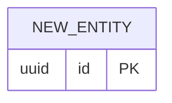

# Implementation plan: [Feature name]

Status: Draft

## Modules

- **Module A**: [responsibility and files.] Covers FR1, FR2.
- **Module B**: [responsibility and files.] Covers FR3.

## Data model changes

Update `docs/21-data-model.md` in the same commit as the migration.

## Key decisions

- **Decision**: [choice]
  - **Discarded alternative**: [alternative]
  - **Rationale**: [why]
  - **ADR**: [link if significant, status Proposed]

## Test strategy

- Unit tests for [module A logic].
- Integration test for [main endpoint/flow].
