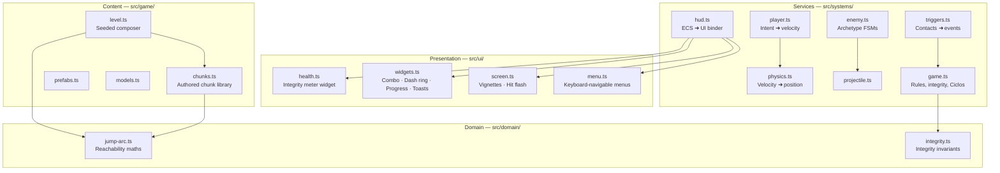

# Plan 024 — Flow & Feel

Design for [spec.md](spec.md). Written before implementation; kept in sync with it.

## 1. Module map

Layer rule enforced: `src/ui/` never imports from `src/game/` or `src/core/`; it takes
plain view-models pushed by `src/systems/hud.ts`. `src/domain/` imports nothing.

## 2. Key decisions (and what was discarded)

| # | Decision | Discarded alternative | Why |
| :--- | :--- | :--- | :--- |
| D-01 | Sub-stepped integration inside the physics system, driven by the largest body displacement. | Swept-sphere continuous collision detection. | Sub-stepping is ~15 lines, reuses the existing discrete solver, and the fastest body in the game (dash, 34 u/s) needs only 2 sub-steps. A swept solver would be a rewrite for no observable gain. |
| D-02 | Accumulate platform carry into `body.carry` and apply it once, after the solver loop. | Skipping the carry on iterations > 0. | The solver may resolve the same contact in any iteration order; a flag would depend on ordering. An accumulator that is zeroed each frame is order-independent. |
| D-03 | Dash direction from the *input vector*, falling back to camera forward. | Keep `transform.yaw` (the model's facing). | `transform.yaw` only updates while there is movement input, so a standing dash fires wherever the model happened to stop. Input-space is what the player's hand expects. |
| D-04 | Authored chunk library + seeded composer with a reachability guard. | (a) Keep the random walk and just tighten the ranges. (b) Fully hand-built levels in JSON. | (a) cannot guarantee reachability and produces no rhythm. (b) kills the infinite-progression pillar in `docs/00-charter.md`. Chunks give authored quality with generated variety. |
| D-05 | Reachability derived analytically in `src/domain/jump-arc.ts` from `gravity`, `jump`, `speed`. | Hard-coded "max gap = 10". | A constant silently breaks the moment anyone tunes gravity or jump. Deriving it means the level generator self-corrects, and the maths is unit-testable with no engine. |
| D-06 | Dash shatters `fragile` Sombras. | Dash is purely evasive. | Purely evasive dashes make enemies a tax. Making the dash offensive turns every Sombra into an opportunity and gives the Resonancia system a second source. |
| D-07 | Health as a segmented meter with a delayed "chip" ghost layer. | A plain pip row (current) or a continuous bar. | Pips show *state* but not *events* — the player never sees the hit land. A chip layer shows how much was lost, after the fact, which is the standard fighting-game readability trick. |
| D-08 | Presentation extracted into `src/ui/` with a thin binder system. | Keep growing `src/systems/hud.ts`. | `hud.ts` was already 282 lines of mixed DOM, `localStorage`, dynamic imports and per-frame layout. The constitution puts presentation in its own layer; the crash in `render()` is exactly what that separation prevents. |
| D-09 | `requestAnimationFrame`-free UI updates: the binder writes only when the value changed. | Rewrite the DOM every frame (current). | Per-frame `textContent` writes on nine nodes cost layout work for nothing. Dirty-checking removes it and makes the HUD testable by asserting on written values. |
| D-10 | Baliza (checkpoint) respawn per rest chunk. | Respawn at the Ciclo origin (current). | With chunk-based levels the origin can be 200 units behind; sending the player back there after a hit is a punishment out of proportion to the mistake. |

## 3. Data model changes

Full entity/component reference lives in [docs/21-data-model.md](../../docs/21-data-model.md).
Deltas introduced by this spec:

### Components added

| Component | Fields | Owner |
| :--- | :--- | :--- |
| `body.groundNormal` | `THREE.Vector3` | physics |
| `body.carry` | `THREE.Vector3`, zeroed each frame | physics |
| `body.groundTimer` | `number`, seconds since last contact | physics |
| `player.dash` | `{ time, cooldown, dirX, dirZ, airLeft }` | player |
| `player.jumpBuffer` | `number` seconds | player |
| `player.jumpHeld` | `boolean` | player |
| `player.coyote` | `number` seconds (was frames) | player |
| `player.checkpoint` | `THREE.Vector3` | game |
| `enemy.fsm` | `{ state, timer, phase }` | enemy |
| `enemy.fragile` | `boolean` | prefabs |
| `enemy.stun` | `number` seconds | enemy |
| `enemy.integrity` | `number` (boss phases) | enemy |
| `projectile` | `{ ttl, damage, speed, owner }` | projectile |
| `checkpoint` | `{ reached: boolean }` | triggers |

### World state added

| Key | Meaning |
| :--- | :--- |
| `state.integrity` | Current Integridad del Núcleo. Replaces the ambiguous `state.lives`. |
| `state.maxIntegrity` | Maximum, for the meter's segment count. |
| `state.comboWindow` | Seconds remaining on the Resonancia, for the HUD arc. |
| `state.dashRatio` | 0..1 dash readiness, for the reticle ring. |
| `state.shield` | Whether the Escudo overlay is active. |

`state.lives` is kept as a mirror of `state.integrity` for one release so that no
existing test or console mod breaks; it is marked deprecated in the data model.

## 4. Feel targets

Derived in [docs/22-game-design.md](../../docs/22-game-design.md); repeated here as the
acceptance numbers this plan is tuned against.

| Quantity | Formula | Target |
| :--- | :--- | :--- |
| Jump apex height | `v0² / (2g)` | 3.4 – 4.2 u |
| Rise time | `v0 / g` | ≈ 0.60 s |
| Fall time (with `fallGravityMultiplier`) | `√(2h / (g·k))` | ≈ 0.45 s |
| Max flat jump distance | `speed · totalAirTime` | 14 – 16 u |
| Design gap (safety 0.62) | `maxDistance · safety` | ≈ 9 u |
| Dash distance | `dashSpeed · dashTime` | ≈ 6.8 u |
| Dash cadence | `dashTime + cooldown` | 1.05 s |
| Telegraph floor | — | 0.45 s |

## 5. Test strategy

| Area | Approach | File |
| :--- | :--- | :--- |
| Jump arc maths | Pure unit tests, no engine, including monotonicity properties (a higher target is never easier to reach). | `tests/jump-arc.test.ts` |
| Reachability of generated Ciclos | Property-style loop over seeds 1..30 asserting every critical-path gap satisfies the invariant. | `tests/level.test.ts` |
| Physics regressions | Direct `World` + `physicsSystem` drives: tunnelling, single carry, no floor bounce, wall slide. | `tests/physics.test.ts` |
| Movement | Mock input; jump buffer, jump cut, coyote in seconds, dash direction, air-dash budget. | `tests/player.test.ts` |
| Enemy FSMs | Drive the systems with a fake world; assert telegraph duration floor and projectile lifecycle. | `tests/enemy.test.ts` |
| Integrity rules | Pure domain tests: damage, shield absorption, clamping, repair. | `tests/integrity.test.ts` |
| HUD binder | jsdom; assert the meter is populated, no throw over 120 frames, aria attributes correct. | `tests/hud.test.ts` |

## 6. Risks

| Risk | Mitigation |
| :--- | :--- |
| Sub-stepping multiplies the O(n²) body-body loop cost. | Sub-steps are computed from the *maximum* displacement and capped at 4; with ≤ 32 bodies the inner loop stays under 500 pair tests per sub-step. |
| Chunk composer produces repetitive levels. | The composer weights chunks by level band and forbids repeating the previous chunk id; intensity alternation adds a second axis of variation. |
| Extracting `src/ui/` breaks the existing settings panel wiring. | The binder keeps the same element ids; the menu module is a move, not a rewrite, and `tests/hud.test.ts` covers the render path. |
| Deprecating `state.lives` breaks console mods. | Mirrored, not removed; documented in the data model with a removal target. |
