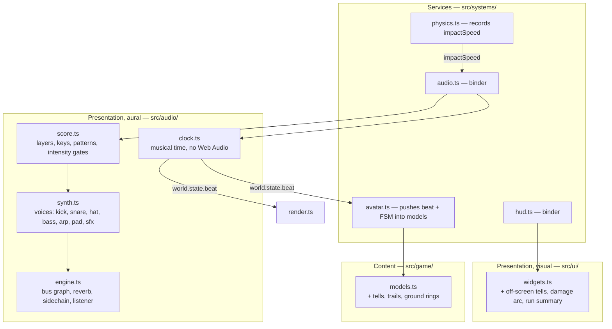

# Plan 025 — Resonancia

Design for [spec.md](spec.md).

## 1. Module map

`src/audio/` is introduced as the aural counterpart to `src/ui/`: a presentation layer
that owns its own domain (the Web Audio graph) and knows nothing about the ECS. The
binder in `src/systems/audio.ts` reads `world.state`, pushes numbers at it, and publishes
the beat back.

## 2. Key decisions

| # | Decision | Discarded | Why |
| :--- | :--- | :--- | :--- |
| D-01 | A **shared musical clock** in `world.state.beat`, published by the audio binder and read by models, environment and UI. | Each system keeping its own timer. | Separate timers drift and cannot be in phase by construction. One clock makes "the world pulses with the music" a contract rather than a coincidence. |
| D-02 | The clock is a **pure module** driven by an injected time source. | Reading `AudioContext.currentTime` directly wherever needed. | It has to keep running with audio muted, blocked or absent (REQ-025.12), and it has to be testable without Web Audio. |
| D-03 | Percussion from a **noise buffer**. | The existing square-oscillator hats. | A square wave at 400 Hz is a tone, not a hat. One 2-second noise buffer, generated once, is cheaper and correct. |
| D-04 | Reverb by **procedural impulse response** through a `ConvolverNode`. | Loading an impulse WAV; or a delay-network reverb. | The charter forbids external assets, and a generated exponential-decay noise IR is eight lines and sounds like a room. |
| D-05 | **Sidechain by scheduled gain automation** on the music bus, triggered with each kick. | A `DynamicsCompressorNode` with a sidechain input. | Web Audio has no sidechain input. Scheduling the duck alongside the kick is sample-accurate and free. |
| D-06 | Intensity is a **smoothed scalar** from three inputs, and layers are gated on thresholds with hysteresis. | Switching arrangements on discrete game events. | Event switching makes the music flap when the player is near the boundary. |
| D-07 | Tells are rendered **by the model**, fed the FSM state through the avatar contract. | The renderer drawing tells from events. | Models already own their own animation; a tell is animation. The renderer would need a parallel registry of what belongs to whom. |
| D-08 | The shockwave warning is a **ground ring at the exact radius**, drawn before the landing. | A generic "danger" flash. | The player needs to know *where* it is safe, not that something is coming. A ring at the true radius is the only honest version. |

## 3. Data model additions

| Key | Meaning |
| :--- | :--- |
| `world.state.beat` | `{ bar, beat, sixteenth, phase, pulse, bpm, intensity }` |
| `world.state.audio` | `{ ready, muted, musicVolume, sfxVolume }` |
| `body.impactSpeed` | Downward speed cancelled by the last floor contact |
| `avatar` state `beat` | The clock, passed to every model each step |
| `avatar` state `fsm` | `{ state, progress }` — telegraph progress normalised 0..1 |
| `world.state.tells` | Array of `{ at, kind, until }` for the HUD's off-screen indicator |

## 4. Test strategy

Web Audio does not exist in jsdom, so the split matters: everything worth testing is in
the pure modules.

| Area | File |
| :--- | :--- |
| Musical clock: bars, beats, phase, pulse decay, resync after a jump | `tests/clock.test.ts` |
| Intensity model: inputs, smoothing, critical override, layer gates | `tests/score.test.ts` |
| `body.impactSpeed` | `tests/physics.test.ts` |
| Off-screen tell projection and the four-item cap | `tests/hud.test.ts` |
| Audio settings persistence | `tests/hud.test.ts` |

## 5. Risks

| Risk | Mitigation |
| :--- | :--- |
| Beat-driven pulsing becomes visual noise. | Every pulse is bounded and additive over a base value; `prefers-reduced-motion` attenuates it. |
| More voices per beat costs CPU. | Voices are one-shot oscillators that stop themselves; the layer count is gated by intensity, so quiet moments are cheap. |
| Ground rings allocate per shockwave. | Pooled, eight instances, recycled oldest-first. |
| Spatial audio with many panners is expensive. | One panner per *sound*, created and released with the voice; the cap is the voice count, which is already bounded. |
